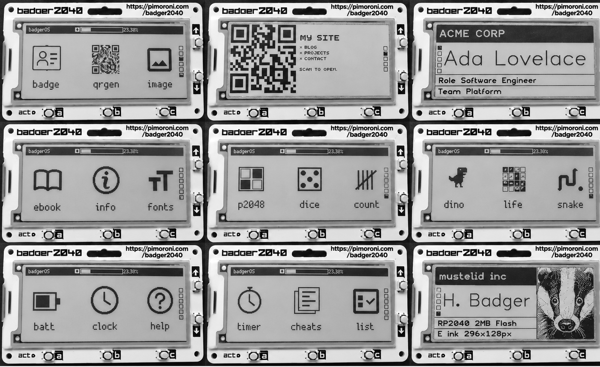

# badger2040

Apps for the [Pimoroni Badger 2040](https://shop.pimoroni.com/products/badger-2040)
— the **non-wireless** one. Everything runs standalone on battery. Flash it
once, deploy once, unplug it.



## Apps

Written for this project:

| App | What it does | Buttons |
|---|---|---|
| `badge` | Multi-profile name badge — any number of profiles in `/badges` | UP/DOWN cycle profiles |
| `batt` | Battery voltage and percentage | A re-read |
| `cheats` | Reference cards from `/cheats/*.txt` | UP/DOWN sheet, A/C page |
| `count` | Three tally counters, persist across power-off | A +1, C −1, UP/DOWN switch, B+UP reset |
| `dice` | Coin, d4–d20, yes/no | A roll, UP/DOWN change die |
| `dino` | Chrome's offline dinosaur | UP jump (*hold* it — e-ink runs ~4fps), B restart |
| `life` | Conway's Game of Life on a wrapping grid | A run/pause, B reseed, C step |
| `p2048` | 2048 | UP/DOWN/A/C slide, B new game |
| `snake` | Snake, walls are fatal | UP/DOWN/A/C steer, B start |
| `timer` | Pomodoro: 25/5, long break every 4th | A start/pause, B reset, C skip, UP/DOWN length |

Shipped with the firmware and kept as-is: `qrgen` (QR deck — contact card, links, guest
wi-fi), `list` (checklist), `ebook`, `image`, `help`, `info`, `fonts`, and
`clock` — which cannot keep time, as the board has no clock chip.

## Buttons

Five front buttons — **UP, DOWN, A, B, C** — plus **BOOT/USR** on the back.

| Press | Does |
|---|---|
| **A + C together** | **Quit any app, back to the menu.** There is no home button; this is it |
| A / B / C in the menu | Open the app in the left / middle / right column |
| UP / DOWN in the menu | Change page |
| BOOT/USR held while plugging in | Mounts as `RPI-RP2` for reflashing |

A press wakes the badge *and* counts as the press, so the screen takes a moment
— it is booting, not lagging. Cold power-on lands on the menu; waking a
sleeping app returns you to it.

Eighteen apps, three per page:

| Page | | | |
|---|---|---|---|
| **1** essentials | `badge` | `qrgen` | `image` |
| **2** games | `dino` | `life` | `snake` |
| **3** games | `p2048` | `dice` | `count` |
| **4** desk tools | `timer` | `cheats` | `list` |
| **5** status | `batt` | `clock` | `help` |
| **6** reading, system | `ebook` | `info` | `fonts` |

Page order comes from the `ORDER` list in `launcher.py` — otherwise the stock
launcher sorts alphabetically and buries the useful apps. Anything not in
`ORDER` still appears, appended at the end. App names stay short because the
launcher gives each about 106px of label.

## Hardware

| Part | Notes |
|---|---|
| [Badger 2040](https://shop.pimoroni.com/products/badger-2040) | The **non-W** board — RP2040, 2 MB flash, 296×128 e-ink. No wi-fi, no clock chip |
| [2×AAA battery holder with switch](https://shop.pimoroni.com/products/battery-holder-2-x-aaa-with-switch) | Leave the switch on and the badge stays powered when unplugged — which makes USB look broken |
| [Case for Pimoroni Badger 2040](https://makerworld.com/en/models/850255-case-for-pimoroni-badger-2040) | 3D printed, from MakerWorld |

Docs: [getting started](https://learn.pimoroni.com/article/getting-started-with-badger-2040#using-badger-os)
· [customising the examples](https://learn.pimoroni.com/article/getting-started-with-badger-2040#customising-the-badgeros-examples)
· [pimoroni/badger2040](https://github.com/pimoroni/badger2040)
· [API reference](https://github.com/pimoroni/badger2040/blob/main/docs/reference.md)

## Setup

**1. Flash.** The board ships with a 2022 image too old for these apps. Get the
**non-W** `...-with-badger-os.uf2` from
[Pimoroni's releases](https://github.com/pimoroni/badger2040/releases), hold
**BOOT/USR** while plugging in, and drop it on the `RPI-RP2` drive. From a
shell use `cp -X` — without it macOS throws an extended-attribute error after
the image has already copied fine. Flashing wipes the filesystem.

**2. Add your content.**

```bash
cp badges/01-work.txt.example badges/01-work.txt
```

Badge files are 7 lines: company, name, detail 1 title, detail 1 text, detail 2
title, detail 2 text, image path (optional — leave blank for text-only). QR
files are: payload, title, then body text. Cheat sheets are: title, then body.

Photo badges: `python3 tools/make_photo.py me.jpg badges/photo.png` crops to
104×128 and dithers to 1-bit.

**3. Deploy.** `pip install mpremote`, then **replug the badge and run this
within a few seconds**:

```bash
tools/deploy.sh
```

An idle badge cuts its own power, so `deploy.sh` refuses to start rather than
copying half the files. Replug and re-run — it is safe to repeat.

## Your data stays out of git

`.gitignore` excludes `badges/*.txt`, `badges/*.png|jpg` and `qrcodes/*.txt`.
Only the `*.txt.example` templates are committed. One codebase, no "personal
branch" — the split is data, not code, and `deploy.sh` copies the real files
while skipping the templates.

## Working on the badge

```bash
python3 tools/test_logic.py       # game rules, on the desktop
tools/run_on_device.sh            # every app, on real hardware
tools/dev_mode.sh on|off|status   # park main.py so the badge stops sleeping
python3 tools/make_icons.py       # regenerate launcher icons
```

`halt()` cuts the 3V3 rail, which powers the RP2040 — so an idle badge drops
off the USB bus entirely, and once it has slept the serial link is gone until
the next boot. Buttons wake the screen, not the REPL. The only way in is the
few seconds after a replug, so `dev_mode.sh on` parks `main.py` and the badge
stays at the REPL while you work. Run `off` when done.

First contact needs plain `mpremote` (its soft reset breaks into a busy board);
every command after wants `mpremote resume` (no reset, so it never reboots into
the launcher and sleeps). Getting that backwards looks exactly like a dead
board. Never kill `mpremote` mid-transfer — it wedges the macOS tty.

**Never call `badger2040.system_speed(SYSTEM_TURBO)`.** It sets 250 MHz without
the core-voltage bump that needs and the chip locks up — no display, no
buttons, no USB. Recovery is a power cycle. `UPDATE_TURBO` is a different,
safe setting. The e-ink refresh sets the frame rate anyway, not the CPU.

Each app keeps its hardware-free logic above a `# --- hardware below ---`
marker, so the tests exec just that part — no second copy of the rules, no
`badger2040` to stub.

## What is patched

Two files come from upstream with local changes; the reasoning lives in their
comments:

- **`launcher.py`** — stock, plus the `ORDER` list for page layout.
- **`main.py`** — boots to the menu instead of reopening the last app, but only
  on a genuine power-on. The `woken_by_button()` guard is load-bearing: without
  it every button press inside an app kicks you back to the menu.

## Credits

No licence is set, so default copyright applies to the code written here.

Built on [pimoroni/badger2040](https://github.com/pimoroni/badger2040), MIT
(© 2023 Pimoroni Ltd). `launcher.py` and `examples/badge.py` derive from it and
stay under that licence, reproduced at
[licenses/pimoroni-badger2040-LICENSE](licenses/pimoroni-badger2040-LICENSE).
The stock apps ship with the firmware and are not redistributed here.

`dino` was inspired by
[niutech/dino-badger2040](https://github.com/niutech/dino-badger2040) but shares
no code — that repo carries no licence, so nothing was copied.
